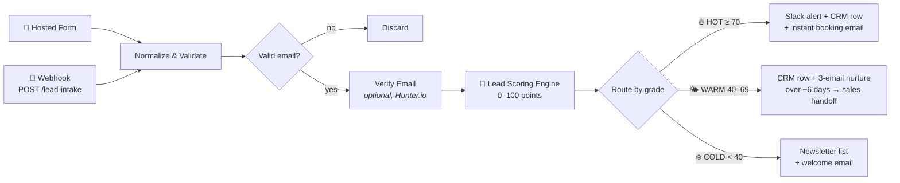

# 🧲 n8n Lead Generation Machine

**Capture → Validate → Enrich → Score → Route → Nurture → Convert.**

A free, importable [n8n](https://n8n.io) workflow that turns raw form
submissions into scored, routed, and nurtured leads — automatically.
Hot leads reach your sales team in seconds. Warm leads get a
3-touch email sequence. Cold leads join your newsletter. No code
changes required to get started.


---

## Why bother?

The research is brutal on slow follow-up:

- Responding to a lead within **5 minutes** makes you **100x more likely
  to reach them** and **21x more likely to qualify them** than waiting
  30 minutes ([MIT Lead Response Management Study](https://25649.fs1.hubspotusercontent-na2.net/hub/25649/file-13535879-pdf/docs/mit_study.pdf)).
- **78% of customers buy from the first business that responds** — yet the
  average company takes **~47 hours**.
- It takes **~8 touches** to earn a first meeting, and **44% of reps give
  up after one** follow-up.

This workflow answers in seconds and never gives up after one touch.

## How it works



### The scoring model (0–100)

| Dimension | Max points | Signals |
|---|---|---|
| **Fit** | 40 | Company size (15) · role/seniority (15) · business email vs. free provider (10) |
| **Intent** | 45 | Start timeline (20) · budget (15) · buying-signal keywords in the message (10) |
| **Source** | 15 | demo-request 15 · pricing-page/referral 12 · webinar 10 · linkedin 8 |
| **Penalties** | — | Student/other −10 · spam keywords −15 · verified-invalid email −30 |

Grades: **HOT ≥ 70 · WARM 40–69 · COLD < 40**. Every lead is saved with a
`scoreBreakdown` field so you can audit and tune the weights against your
actual closed-won vs. closed-lost deals.

## Quick start

1. **Import** — in n8n go to *Workflows → Import from File* and select
   [`n8n-lead-generation-machine.json`](n8n-lead-generation-machine.json)
   (works on n8n Cloud and self-hosted, n8n ≥ 1.x).
2. **Attach credentials** (n8n never bundles credentials in templates):
   | Nodes | Credential | Notes |
   |---|---|---|
   | 5× *Send Email* | SMTP | Or swap for Gmail / Outlook nodes |
   | 2× *Slack* | Slack API | Default channel `#sales-leads` |
   | 3× *Save…* | Google Sheets | One spreadsheet with tabs `Hot`, `Warm`, `Newsletter` — or replace with HubSpot / Pipedrive / Airtable nodes |
3. **Personalize** — replace `YOUR NAME`, `YOUR COMPANY`, the
   `cal.com/YOUR-BOOKING-LINK` booking URL, and the lead-magnet /
   case-study links in the email nodes.
4. *(Optional)* enable the disabled **Verify Email with Hunter** node and
   paste your API key. The workflow runs fine with it off — the merge
   step passes data through unchanged.
5. **Activate** the workflow. Done.

## Feeding it leads

Two entry points, both live as soon as the workflow is active:

**A. Hosted form (zero setup)** — open the *Lead Capture Form* node and
copy its *Form URL*. n8n hosts the form for you: link it from your site,
ads, email signature, or a QR code.

**B. Webhook (any source)** — `POST` JSON to `/webhook/lead-intake`:

```json
{
  "name": "Jane Smith",
  "email": "jane@acme.com",
  "company": "Acme Inc",
  "company_size": "11-50",
  "role": "VP / Director",
  "timeline": "Right away",
  "budget": "$2,000 - $10,000",
  "message": "Need a demo",
  "source": "pricing-page"
}
```

Only `email` is strictly required — missing fields score neutrally.
Always send `source`: it feeds the scoring model and tells you which
channels produce hot leads.

| Where leads come from | How to plug it in |
|---|---|
| Content / SEO lead magnet | Gate the download behind the hosted form |
| Google & Meta / LinkedIn Lead Ads | Point the ad platform's webhook at `/lead-intake`, `source: "ads"` |
| Pricing or demo page | Site form POSTs to the webhook, `source: "pricing-page"` |
| Webinars & events | Registration tool webhook → `/lead-intake`, `source: "webinar"` |
| Referrals & partners | Shared form link, `source: "referral"` |
| Outbound (cold email / LinkedIn) | Interested replies get the form link |

## Customizing

Everything lives in plain, commented nodes:

- **Tune the scoring** — edit the lookup tables in the *Lead Scoring
  Engine* Code node (sizes, roles, budgets, keywords, sources). Recheck
  monthly: won deals should score higher than lost ones.
- **Swap the CRM** — replace the three Google Sheets nodes with HubSpot,
  Pipedrive, Salesforce, or Airtable nodes; the normalized lead object
  maps straight in.
- **Extend the nurture sequence** — add more *Wait → Send Email* pairs,
  or an IF node that checks your CRM and exits once the lead replies or
  books.
- **Add AI qualification** — insert an LLM node after scoring that reads
  `message` and adjusts the score or drafts the first reply.
- **Change the thresholds** — HOT/WARM/COLD cutoffs are two numbers in
  the scoring node.

## KPIs worth tracking

| Metric | Healthy target |
|---|---|
| Time from capture to first sales contact (hot leads) | < 5 minutes |
| MQL → SQL acceptance rate | > 60% |
| SQL → opportunity conversion | > 30% |
| Nurture email reply/click rate | trending up per touch |

## Repo contents

```
.
├── README.md                          ← you are here
└── n8n-lead-generation-machine.json   ← import this into n8n
```

## Research & sources

[REWORK.](https://reworkdigital.io/)
[MIT Lead Response Management Study](https://25649.fs1.hubspotusercontent-na2.net/hub/25649/file-13535879-pdf/docs/mit_study.pdf) ·
[InsideSales response-time research](https://www.insidesales.com/response-time-matters/) ·
[Lead response statistics](https://caseyresponse.com/blog/lead-response-time-statistics) ·
[B2B lead scoring model](https://scalarly.com/blog/b2b-lead-scoring-model/) ·
[MQL vs SQL benchmarks](https://leadsuitenow.com/blog/sales-qualified-leads-vs-marketing-qualified-leads-2026) ·
[Lead nurturing strategies](https://martal.ca/lead-nurturing-lb/) ·
[Nurture sequence examples](https://www.sequenzy.com/blog/email-nurture-sequence-examples) ·
[n8n export/import docs](https://docs.n8n.io/workflows/export-import/)

## License

MIT — free for personal and commercial use. A star ⭐ or a link back is
appreciated if this saved you time.
